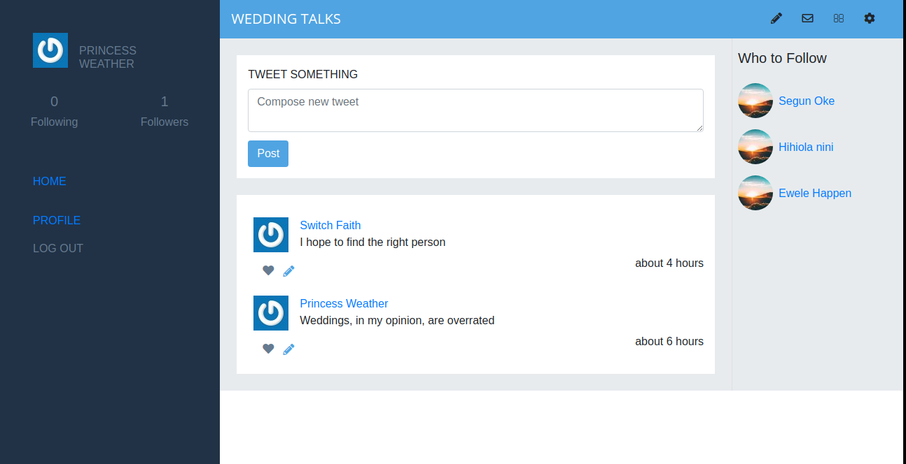
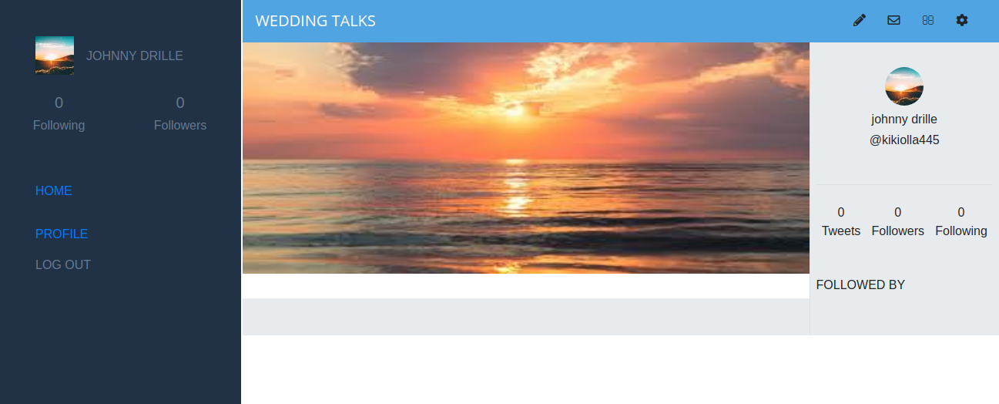

# TWITTER REDESIGN

1. The user logs in to the app, only by typing the username (a proper authenticated login is **not** a requirement).
2. The user is presented with the homepage (see the *Homepage* screenshot above) that includes:
    1. Left-side menu (includes only links to pages that are implemented).
    2. *Tweets* tab in the centre (skip *Photos* and *Videos* for this MVP).
    3. Right-side section with *Who to follow (*skip *Trending for* this MVP).
3. The *Tweets* section includes:
    1. Simple form for creating a tweet.
    2. List of all tweets (sorted by most recent) that display tweet text and author details.
4. The *Who to follow* section includes:
    1. List of profiles that are not followed by the logged-in user (ordered by most recently added).
5. When the user opens the profile page (see the *Userpage* screenshot above), they can see:
    1. Left-side menu (includes only links to pages that are implemented).
    2. Cover picture and *Tweets* tab in the centre (skip other tabs and *Tweet to user* form).
    3. Right-side section with *Profile detailed info.*
6. The *Profile detailed info* section includes:
    1. User photo.
    2. Button to follow a user.
    3. Stats: total number of tweets, number of followers and number of following users.
    4. List of people who follow this user.
7. At the end extend your MVP app with one simple feature of your choice.

## Built With
- Ruby
- Ruby on Rails
- RSpec and Capybara
- PostgresSQL

## Getting Started
To get a local copy up and running follow these simple example steps:
 
### Prerequisite
- Install rails or checkout the <a href="https://guides.rubyonrails.org/getting_started.html">Rails Guide</a> on how to setup the rails environment
- Code editor
- Git and Github

## Usage
- Clone the project to your local machine
- Open your terminal and type the following:
- Run bundle install
- rails db:create
- rails db:migrate
- rails server
- rspec --format documentation (*** for testing ***)

- Open http://localhost:3000/ in your browser

## Set-up
- Set up the cloudinary configuration on a new file (as seen in config/initializers/cloudinary.rb)

- Call this cloudinary credentials from any newly created file in the config directory using ENV variables

### Link on Heroku
https://glacial-shelf-88307.herokuapp.com/

## Author
- Okikiola Apelehin

- Github: [@okikiola11](https://github.com/okikiola11)
- Twitter: [@Kikiolla3](https://twitter.com/Kikiolla3)
- Linkedin: [@okikiola-apelehin](https://www.linkedin.com/in/okikiola-apelehin-459008122/)

## 🤝 Contributing

Contributions, issues and feature requests are welcome!

Feel free to check the [issues page](https://github.com/praz99/twitter-design/issues).

## Show your support

Give a ⭐️ if you like this project!

## Acknowledgments

- Google

## 📝 License

This project is [MIT](lic.url) licensed.
